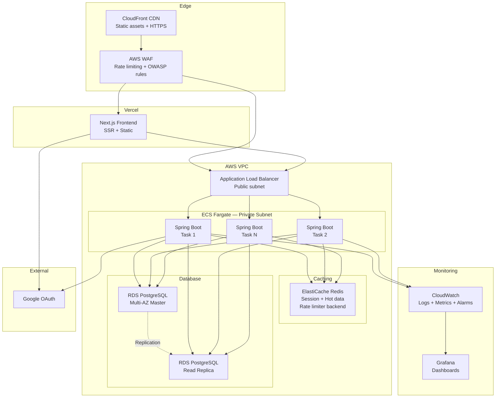

# Visualisasi Arsitektur Yomu AdvPro-13
Repository ini merujuk pada aplikasi Yomu yang berada di organisasi AdvPro-13, arsitektur yang dipakai berupa Modular Monolith yang memiliki pola arsitektur Clean Architecture. Berikut adalah visualisasi dari arsitektur yang digunakan dalam projek ini.

## Context Diagram

## Container Diagram

## Deployment Diagram

## Rencana Arsitektur Aplikasi di Masa Depan

## Bagaimana kami menerapkan risk storming

Risk Storming adalah teknik kolaboratif untuk mengidentifikasi risiko arsitektur dengan memvisualisasikan skenario kegagalan sebelum terjadi. Kami menerapkannya pada arsitektur Yomu dengan pertanyaan: Jika proyek ini sukses dan mencapai 100K+ pengguna aktif harian besok, apa yang pertama kali akan rusak?

### Cara Kami Mengidentifikasi Risiko

Untuk setiap lapisan arsitektur, kami mengajukan tiga pertanyaan:

| Pertanyaan | Contoh |
|---|---|
| Apa yang terjadi jika ini gagal? | PostgreSQL crash → seluruh platform down (SPOF) |
| Apa yang terjadi jika ini kewalahan? | 1000 submission quiz bersamaan → single instance kolaps |
| Apa yang terjadi jika ini diserang? | XSS mencuri JWT dari localStorage → pengambilalihan akun massal |

Kami kemudian memetakan setiap risiko ke lapisan arsitekturnya dan menentukan tingkat keparahan:

| Layer | Risiko yang Ditemukan |
|---|---|
| Security | JWT di localStorage — permukaan serangan XSS |
| Data | Single PostgreSQL instance — tanpa failover, tanpa read scaling |
| Compute | Single compute instance — tanpa horizontal scaling |
| Caching | Tidak ada cache layer — setiap request langsung ke DB |
| Observability | Tidak ada monitoring — buta terhadap gangguan |
| API Protection | Tidak ada rate limiting — rentan DDoS |

---

### Bagaimana Risiko Membentuk Arsitektur Masa Depan

Setiap mitigasi secara langsung mempengaruhi desain arsitektur:

| Risiko | Mitigasi | Perubahan Arsitektur |
|---|---|---|
| JWT terekspos ke JavaScript | httpOnly Cookie | Token dipindahkan ke secure cookie — vektor XSS dihilangkan |
| Database single point of failure | Multi-AZ RDS + Read Replica | Jalur read/write dipisahkan, auto-failover |
| Tidak bisa scaling melebihi satu instance | ECS Fargate auto-scale | Kapasitas elastis yang menyesuaikan permintaan |
| Setiap request langsung ke DB | ElastiCache Redis | 80%+ traffic read diserap di cache layer |
| Tidak ada visibilitas ke kesehatan sistem | CloudWatch + Grafana | Dashboard real-time, alert anomali |
| Tidak ada proteksi penyalahgunaan | AWS WAF + rate limiting | Memblokir traffic berbahaya di edge |

---

### Mengapa kami memilih untuk Tetap Monolith

Risk storming juga memvalidasi keputusan kami untuk tidak memecah sistem menjadi microservices. Risiko yang kami temukan, single database, single instance, tidak ada caching, adalah masalah infrastruktur, bukan masalah arsitektur. Memecah menjadi microservices justru akan menambah lebih banyak risiko (network latency, distributed tracing, konsistensi data) tanpa menyelesaikan akar masalahnya. Modular monolith di atas infrastruktur yang scalable (ECS, RDS, ElastiCache) mengatasi risiko nyata sambil menjaga kompleksitas operasional tetap manageable untuk tim kecil.
## Kerentanan dan Keamanan Aplikasi
...

## Individual Works

### Rifqi's Container

### Nadya's Container

### Azzaka's Container

### Marco's Container

### Muhathir's Container
##### Container Diagram

##### Code Diagram
