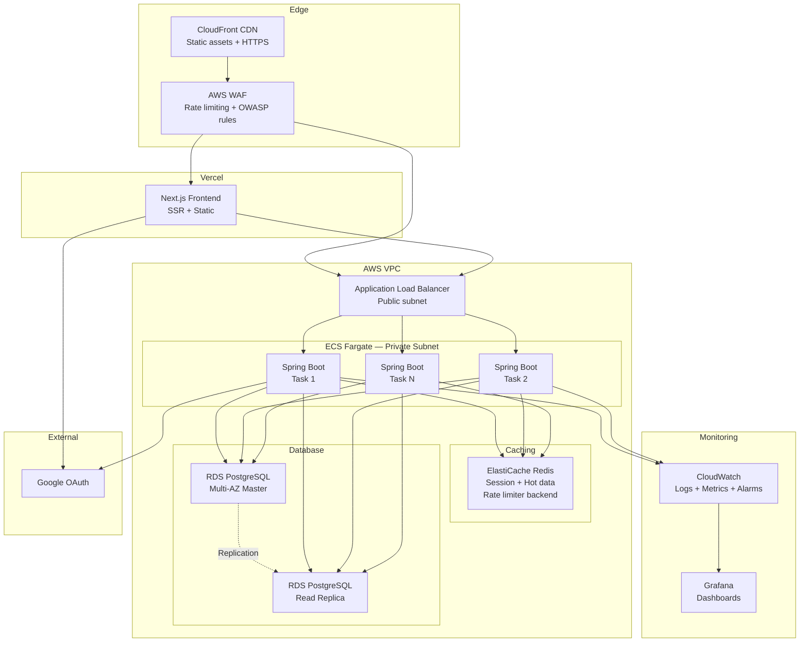

# Visualisasi Arsitektur Yomu AdvPro-13
Repository ini merujuk pada aplikasi Yomu yang berada di organisasi AdvPro-13, arsitektur yang dipakai berupa Modular Monolith yang memiliki pola arsitektur Clean Architecture. Berikut adalah visualisasi dari arsitektur yang digunakan dalam projek ini.

## Context Diagram

## Container Diagram

## Deployment Diagram

## Rencana Arsitektur Aplikasi di Masa Depan

## Kerentanan dan Keamanan Aplikasi
...

## Individual Works

### Rifqi's Container

### Nadya's Container

### Azzaka's Container

### Marco's Container

### Muhathir's Container
##### Container Diagram

##### Code Diagram
