# Visualisasi Arsitektur Yomu AdvPro-13
Repository ini merujuk pada aplikasi Yomu yang berada di organisasi AdvPro-13, arsitektur yang dipakai berupa Modular Monolith yang memiliki pola arsitektur Clean Architecture. Berikut adalah visualisasi dari arsitektur yang digunakan dalam projek ini.

## Context Diagram
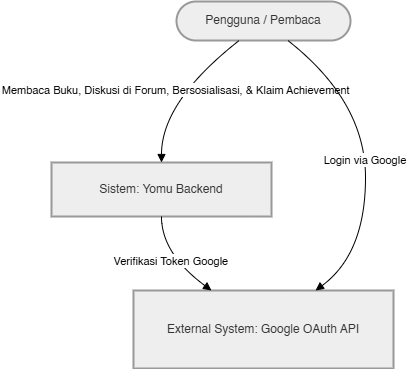
Context diagram menggambarkan Yomu sebagai satu sistem tunggal yang berinteraksi dengan dua aktor utama: Pelajar yang menggunakan aplikasi untuk membaca, mengerjakan kuis, dan berpartisipasi dalam sistem gamifikasi; serta Admin yang mengelola konten, moderasi, dan siklus liga. Sistem juga terhubung dengan layanan eksternal Google OAuth untuk keperluan autentikasi Single Sign-On.

## Container Diagram
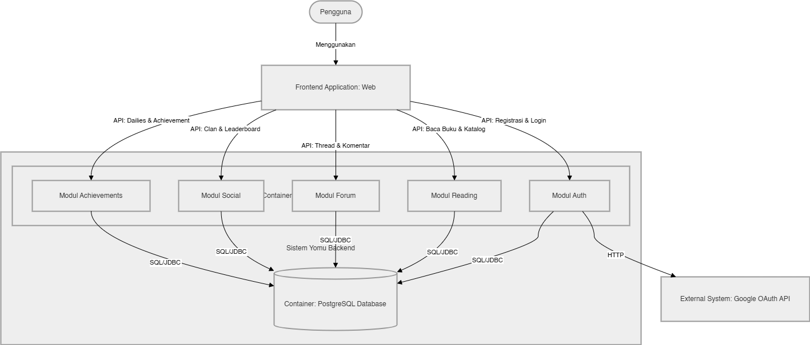
Container diagram menunjukkan bahwa Yomu terdiri dari tiga container utama: Next.js Frontend yang di-deploy di Vercel sebagai antarmuka pengguna, Spring Boot Monolith yang berjalan di AWS ECS Fargate sebagai inti pemrosesan logika bisnis, dan PostgreSQL sebagai penyimpanan data utama. Komunikasi antara frontend dan backend dilakukan melalui REST API over HTTPS, sementara komunikasi antar modul di dalam monolith menggunakan Spring ApplicationEvent untuk menjaga loose coupling.

## Deployment Diagram
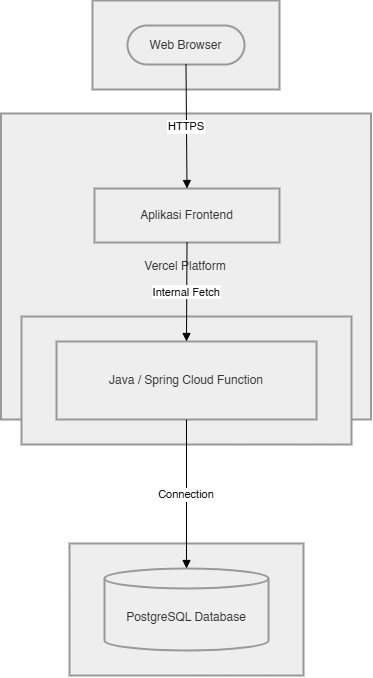
Deployment diagram menggambarkan infrastruktur Yomu saat ini yang berjalan pada satu environment: frontend di Vercel dan backend pada satu instance AWS ECS Fargate dengan satu database PostgreSQL. Arsitektur ini dipilih karena sederhana dan cukup untuk kebutuhan pengembangan awal tim kecil.

## Rencana Arsitektur Aplikasi di Masa Depan
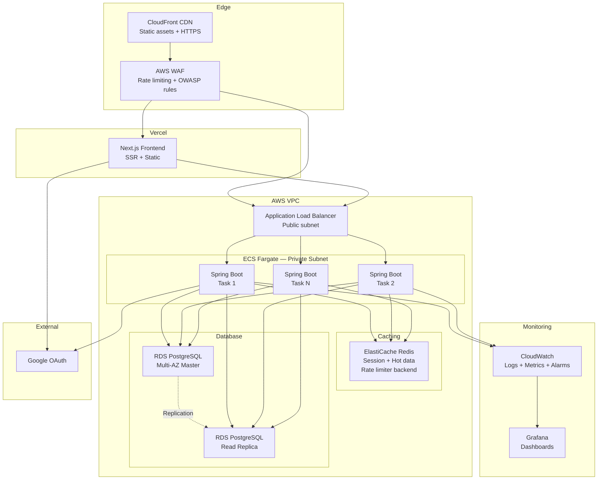
## Bagaimana kami menerapkan risk storming

Risk Storming adalah teknik kolaboratif untuk mengidentifikasi risiko arsitektur dengan memvisualisasikan skenario kegagalan sebelum terjadi. Kami menerapkannya pada arsitektur Yomu dengan pertanyaan: Jika proyek ini sukses dan mencapai 100K+ pengguna aktif harian besok, apa yang pertama kali akan rusak?

### Cara Kami Mengidentifikasi Risiko

Untuk setiap lapisan arsitektur, kami mengajukan tiga pertanyaan:

| Pertanyaan | Contoh |
|---|---|
| Apa yang terjadi jika ini gagal? | PostgreSQL crash → seluruh platform down (SPOF) |
| Apa yang terjadi jika ini kewalahan? | 1000 submission quiz bersamaan → single instance kolaps |
| Apa yang terjadi jika ini diserang? | XSS mencuri JWT dari localStorage → pengambilalihan akun massal |

Kami kemudian memetakan setiap risiko ke lapisan arsitekturnya dan menentukan tingkat keparahan:

| Layer | Risiko yang Ditemukan |
|---|---|
| Security | JWT di localStorage — permukaan serangan XSS |
| Data | Single PostgreSQL instance — tanpa failover, tanpa read scaling |
| Compute | Single compute instance — tanpa horizontal scaling |
| Caching | Tidak ada cache layer — setiap request langsung ke DB |
| Observability | Tidak ada monitoring — buta terhadap gangguan |
| API Protection | Tidak ada rate limiting — rentan DDoS |

---

### Bagaimana Risiko Membentuk Arsitektur Masa Depan

Setiap mitigasi secara langsung mempengaruhi desain arsitektur:

| Risiko | Mitigasi | Perubahan Arsitektur |
|---|---|---|
| JWT terekspos ke JavaScript | httpOnly Cookie | Token dipindahkan ke secure cookie — vektor XSS dihilangkan |
| Database single point of failure | Multi-AZ RDS + Read Replica | Jalur read/write dipisahkan, auto-failover |
| Tidak bisa scaling melebihi satu instance | ECS Fargate auto-scale | Kapasitas elastis yang menyesuaikan permintaan |
| Setiap request langsung ke DB | ElastiCache Redis | 80%+ traffic read diserap di cache layer |
| Tidak ada visibilitas ke kesehatan sistem | CloudWatch + Grafana | Dashboard real-time, alert anomali |
| Tidak ada proteksi penyalahgunaan | AWS WAF + rate limiting | Memblokir traffic berbahaya di edge |

---

### Mengapa kami memilih untuk Tetap Monolith

Risk storming juga memvalidasi keputusan kami untuk tidak memecah sistem menjadi microservices. Risiko yang kami temukan, single database, single instance, tidak ada caching, adalah masalah infrastruktur, bukan masalah arsitektur. Memecah menjadi microservices justru akan menambah lebih banyak risiko (network latency, distributed tracing, konsistensi data) tanpa menyelesaikan akar masalahnya. Modular monolith di atas infrastruktur yang scalable (ECS, RDS, ElastiCache) mengatasi risiko nyata sambil menjaga kompleksitas operasional tetap manageable untuk tim kecil.

## Kerentanan dan Keamanan Aplikasi
Berdasarkan hasil risk storming yang telah dilakukan, kami mengidentifikasi beberapa kerentanan utama pada arsitektur Yomu saat ini beserta mitigasi yang telah dan akan diterapkan.

### JWT di localStorage
Pada implementasi saat ini, JWT access token disimpan di localStorage browser. Ini merupakan kerentanan terhadap serangan Cross-Site Scripting (XSS). Apabila ada script berbahaya yang berhasil diinjeksikan ke halaman, token dapat dicuri dan digunakan untuk mengambil alih akun pengguna.
Mitigasi yang direncanakan: Memindahkan token ke httpOnly Cookie sehingga tidak dapat diakses oleh JavaScript sama sekali. Perubahan ini sudah tercermin pada arsitektur masa depan.

### Single PostgreSQL Instance (SPOF)
Arsitektur saat ini hanya menggunakan satu instance PostgreSQL tanpa failover. Jika database mengalami gangguan, seluruh platform akan ikut down karena semua modul bergantung pada satu sumber data yang sama.
Mitigasi yang direncanakan: Menggunakan RDS PostgreSQL Multi-AZ dengan Read Replica untuk memisahkan jalur read/write dan mengaktifkan auto-failover otomatis.

### Tidak Ada Cache Layer
Setiap request dari pengguna, termasuk untuk leaderboard dan data profil yang jarang berubah, langsung menyentuh database. Pada skala besar, ini akan menjadi bottleneck yang signifikan.
Mitigasi yang direncanakan: Menambahkan ElastiCache Redis sebagai cache layer. Data yang sering diakses seperti leaderboard dan session dapat di-cache sehingga mengurangi beban database secara drastis.

### Tidak Ada Rate Limiting
Tidak ada mekanisme pembatasan request saat ini, sehingga endpoint publik rentan terhadap serangan brute force maupun DDoS.
Mitigasi yang direncanakan: Menambahkan AWS WAF di edge layer dengan aturan rate limiting dan perlindungan OWASP untuk memblokir traffic berbahaya sebelum mencapai aplikasi.

## Individual Works

### Rifqi's Container
#### Container Diagram
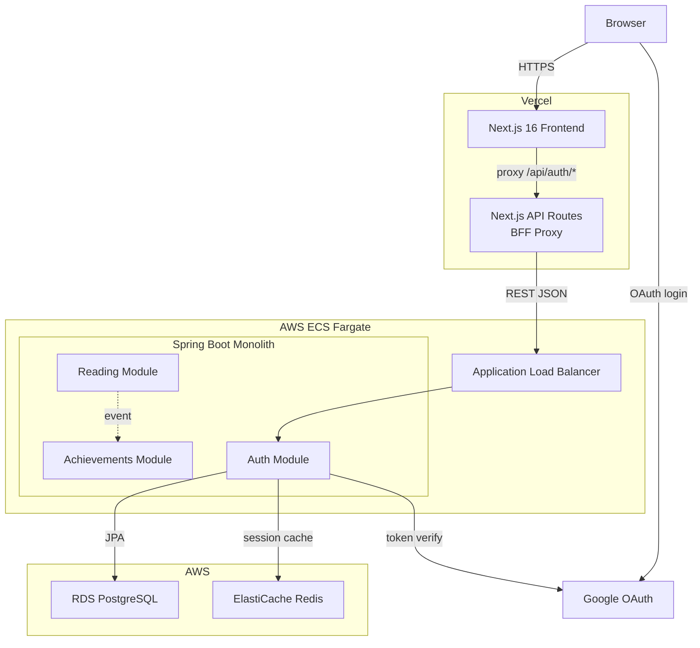

#### Component Diagram
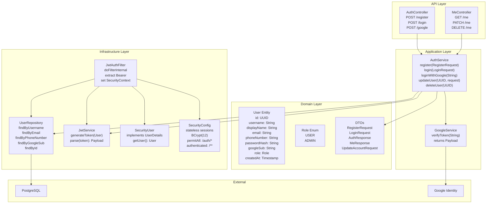

#### Login, Register & Google SSO
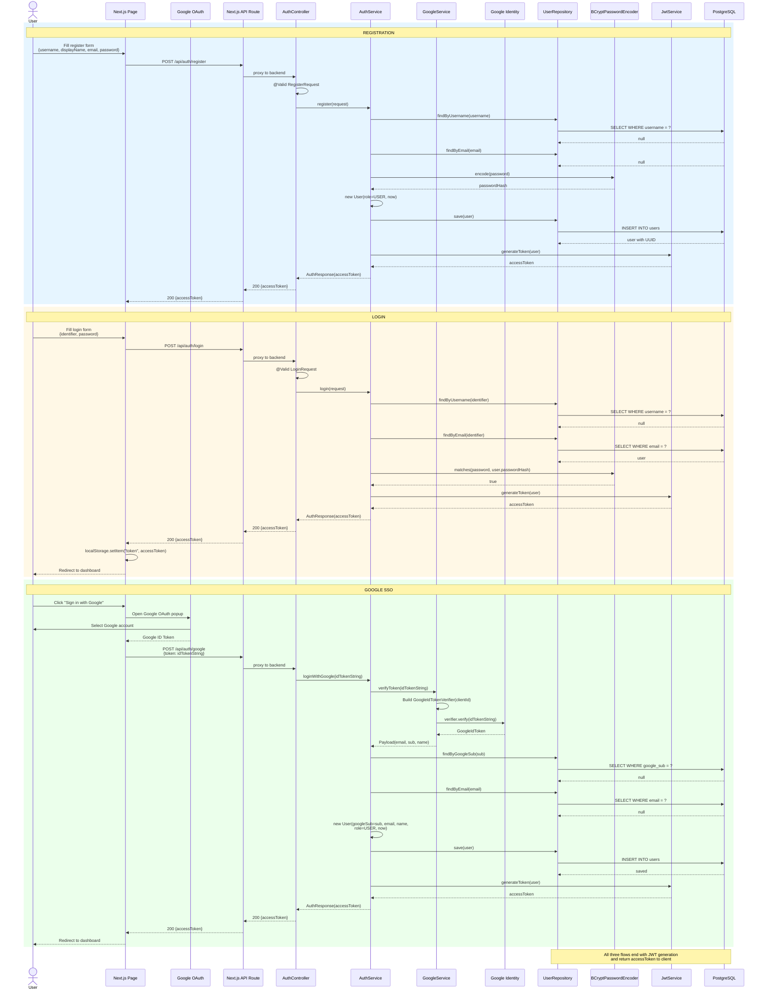

#### JWT Filter & Authenticated Request
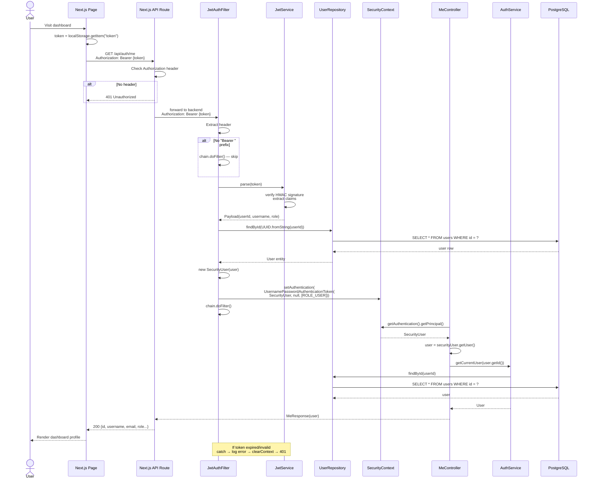

### Nadya's Container

### Azzaka's Container
##### Container Diagram
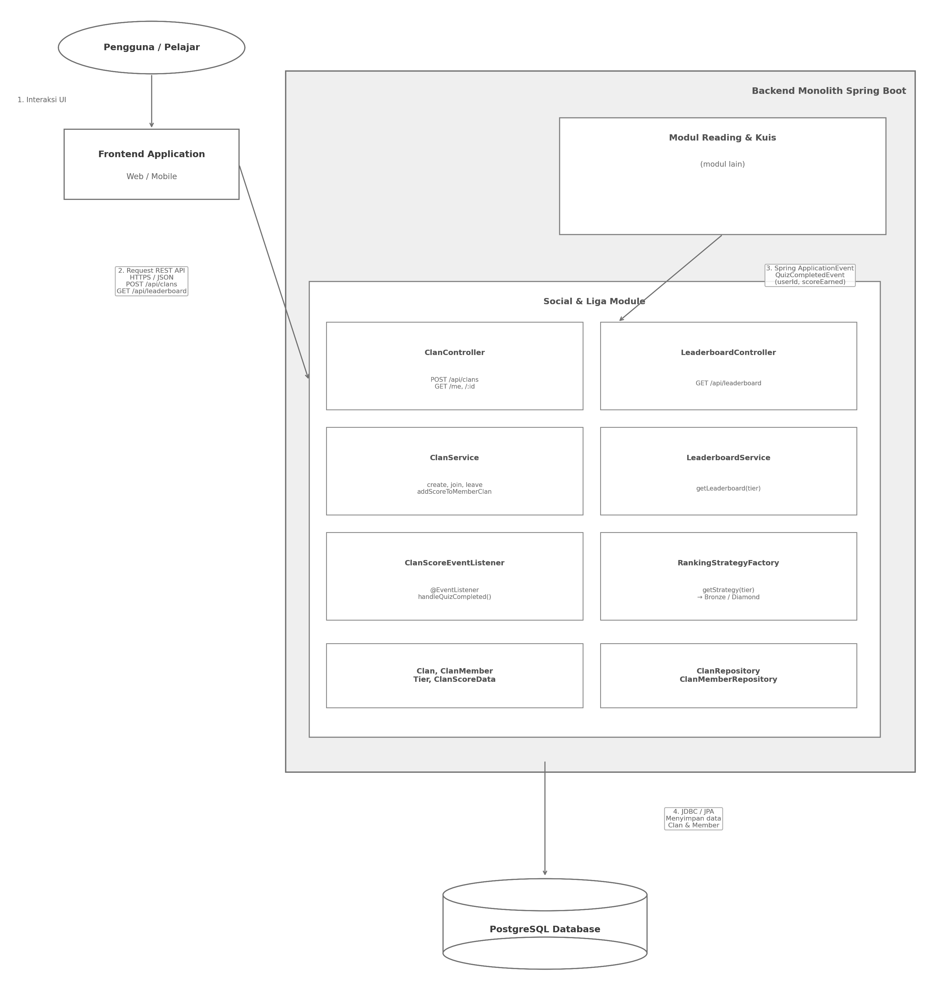

##### Code Diagram — Strategy Pattern

##### Code Diagram — Entities
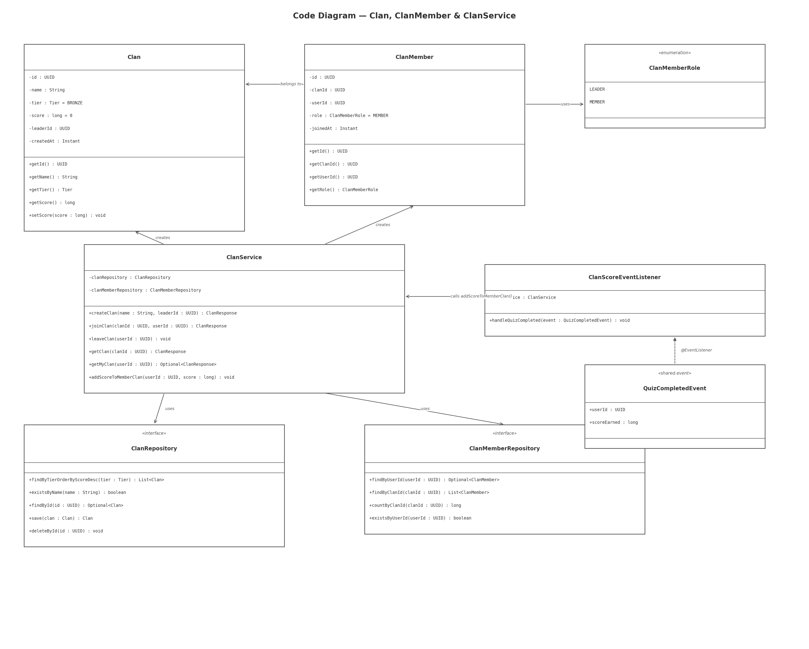

### Marco's Container
##### Container Diagram
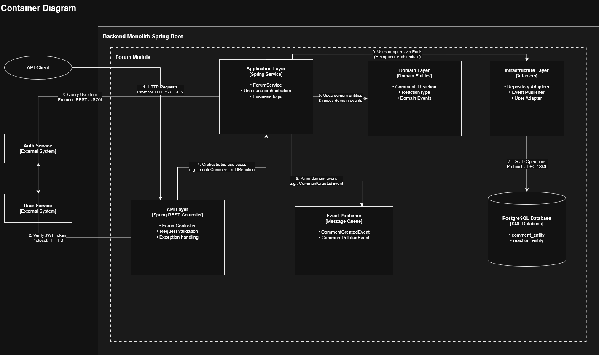

##### Component Diagram
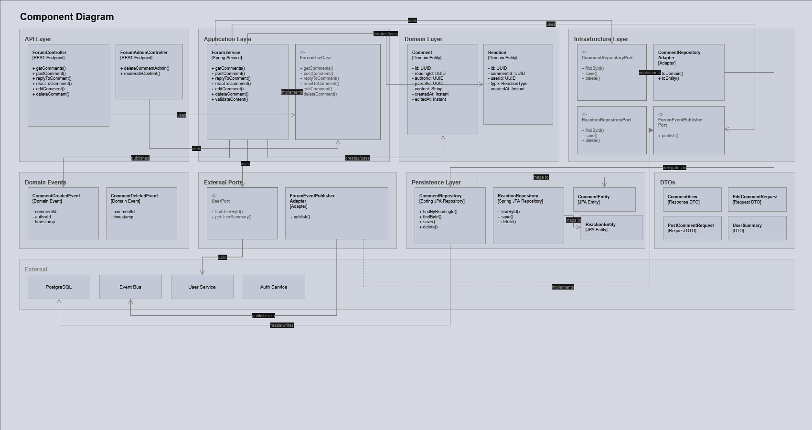

### Muhathir's Container
##### Container Diagram
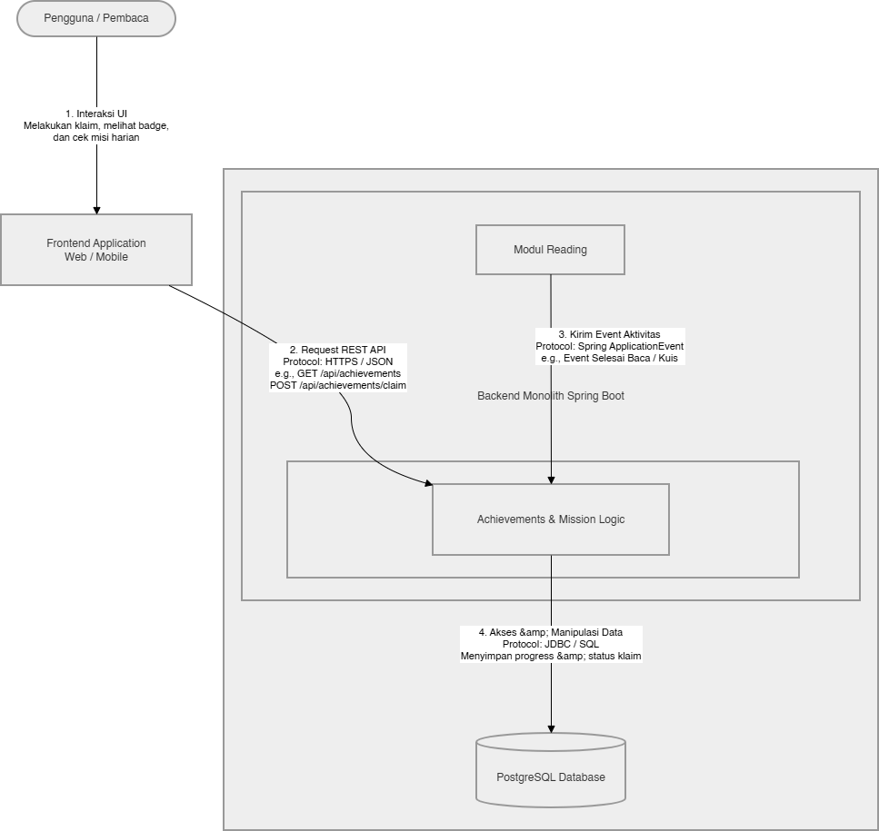

##### Code Diagram
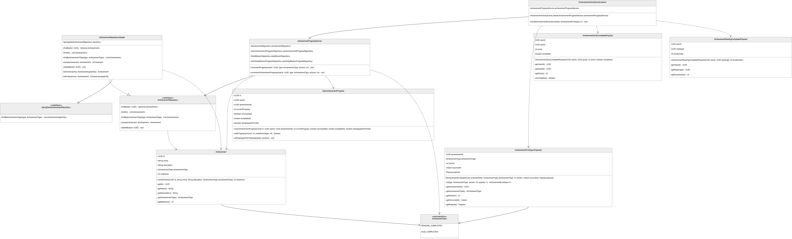